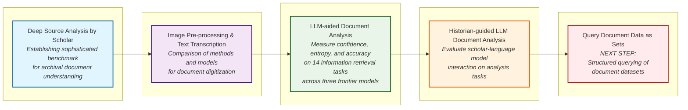

# SETS a Set-Based Architecture for Knowledge Integration and Discovery

The goal of SETS is to improve the performance of AI in the domain of humanities research on archival sources. 

Our primary focus is on what we call “deep sources”. These are handwritten archival documents that contain multiple layers of meaning: their meaning is encoded as text, but also in distinctive graphical marks, physical attributes and visual layout patterns. Meaning further accumulates over time as the documents are modified, change ownership, and are reused and reinterpreted beyond the intention of their initial creation. 

Deep sources are ubiquitous, found in both public and private holdings, and as important as they are difficult to access and read. Archival collections are vast, measuring in the millions of shelving kilometers worldwide and holding unique documents of high information density per square centimeter. These materials  are crucial to the understanding of our shared past, which in turn informs choices about the future. But understanding the past is not simply a matter of information retrieval. It requires careful attention, mediation and interpretation of archival sources. 

The name SETS is rooted in our belief that leveraging the mathematical flexibility of set theory will be fundamental to achieving our goal. Set theory will allow us to represent knowledge as a dynamic graph structure where entities, relationships, and even concepts are defined within the graph itself as nested sets. In a SETS graph, meaning resides in the topological structure, which is inherently mutable and extensible, allowing the framework to evolve alongside scholarly inquiry and discovery. This architecture complements the complex and layered history of deep sources and the scholarship that makes them accessible enabling the creation of new knowledge.

Preliminary work on the development of SETS began in the Spring of 2025 when the team was awarded a Propel grant from the Dean of Research at Stanford University. The Propel grant funded experiments to improve efficiency in learning from archival handwritten sources, a complex and time-consuming task that severely constrains the scope of research agendas. We looked at approaches to scaling the analysis of a set of disconnected images from an archive which required defining the components of scholarly analysis of deep sources and the dimensions to consider when designing evaluation metrics.

# Evaluating Human-AI Interaction with Deep Sources 

Our first step was creating a benchmark for human-model interaction in the analysis of deep sources (Lee et al, 2024). This evaluation framework aims to improve upon existing benchmarks for multi-modal models by taking a deep and focused approach rather than a broader but flatter approach (Yue et al, 2024). Our framework attends to the complexity of deep sources as textual, visual, and physical objects, while also taking into account the theoretical and methodological approaches of the scholar. 

Whereas existing benchmarks address general reasoning capabilities, we offer a benchmark for deep sources that evaluates models on an actual workflow, measuring real task completion rather than using proxy metrics. Our benchmark design is grounded in the following assumptions:

1. A world model in the humanities is not singular and general, but discipline-specific, informed by previous research,  evolving as research insights emerge and as interpretive paradigms change..  
2. Deep sources hold information in their physical qualities that cannot be accessed in current digital surrogates.  
3. While the potential to scale-up research in the humanities motivates our interest in AI, deep sources will always be a minority data domain because their unique qualities are intertwined with historical moments, geographical setting, political circumstances, etc..

## Experiments and Outcomes

## References

Lee, Mina, Megha Srivastava, Amelia Hardy, et al. 2024\. “Evaluating Human-Language Model Interaction.” [https://arxiv.org/abs/2212.09746](https://arxiv.org/abs/2212.09746).

Yue, Xiang, Yuansheng Ni, Kai Zhang, et al. 2024\. “MMMU: A Massive Multi-Discipline Multimodal Understanding and Reasoning Benchmark for Expert AGI.” *Proceedings of the IEEE/CVF Conference on Computer Vision and Pattern Recognition (CVPR)*, June, 9556–67.

## 

## Team

### Leads  
- Giovanna Ceserani  
- Sebastian Ahnert  
### Contributors  
- Nicole Coleman  
- Allen Romano  
- Huijun Mao  
- Teresa Ceserani  
### Consultants  
- Diyi Yang  
- Michele Mauri
