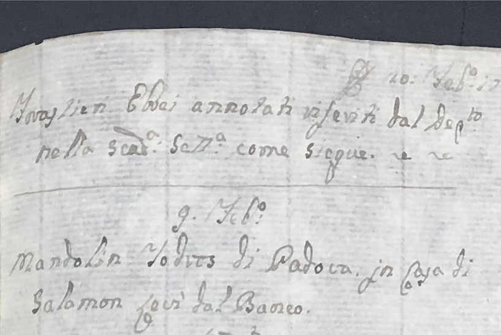
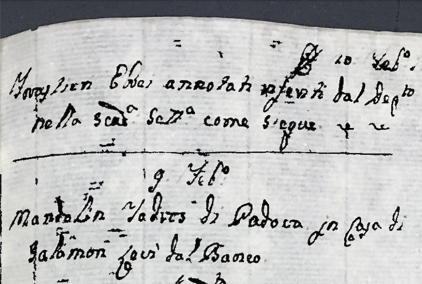
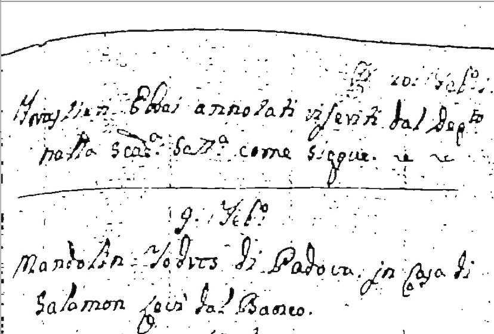
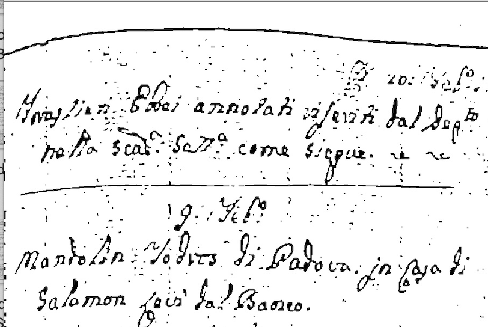
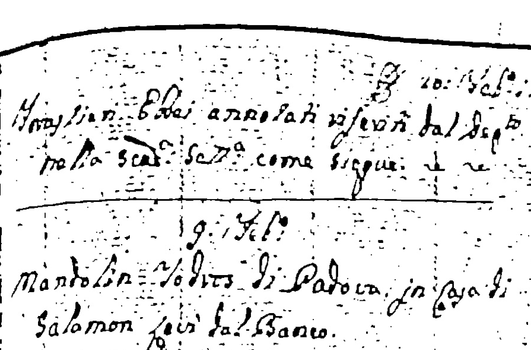

<p class="parent-link"><a href="{{ '/deep-sources/' | relative_url }}">← Deep Source Analysis with LLMs</a></p>

# Historical Document Processing: From non-professional photographs taken in the archive to digital text

## Complete Workflow Overview

Our research combines multiple image processing techniques with LLMs to transform historical handwritten documents into searchable digital text. The complete pipeline consists of four main stages:

```
┌─────────────────┐    ┌─────────────────┐    ┌─────────────────┐    ┌─────────────────┐
│   Photographed  │───▶│     Image       │───▶│  Enhanced       │───▶│    LLM OCR      │
│   Historical    │    │  Processing     │    │   Output        │    │   Pipeline      │
│   Document      │    │                 │    │   Images        │    │                 │
└─────────────────┘    └─────────────────┘    └─────────────────┘    └─────────────────┘
                                ↓                        ↓                        ↓
                       Multiple Methods:           Ready for AI:            📝 Digital Text:
                       • Adaptive                 • Clean, enhanced        • Automatic transcription
                       • Graph Analysis           • High contrast          • Structured output
                       • Color Filtering          • Noise-free             • Searchable content
                       • Edge Detection           • Optimized format       
```

## The Challenges

Archives of handwritten documents are vast, measuring in the millions of shelving kilometers worldwide. And yet, many have not been professionally scanned and digitized. Instead, scholars will often take photographs of the documents while visiting the archive. The quality of the resulting images can be poor:
- **Physically deteriorating** images can be difficult to capture because of faded ink, discolored paper
- **Inconsistent lighting per image** can result in shadows, making parts of the page difficult to read
- **Unstable lighting conditions** make it difficult to find a single comprehensive technique that works for all images in a groupf 

As a result, computational research with these materials is limited because:
- **Time-consuming to transcribe** manually by historians and archivists
- **Existing computer vision techniques** are limited for pre-processing to produce machine-readable images

**Our goal:** Automated enhancement and transcription of non-professionally photographed handwritten archival documents. 

---

## Image Processing Methods
We experimented with and evaluated multiple computer vision image preprocessing techniques to reduce noise, and improve machine readability. This approach follows preprocessing methods from prior work [^1].

### Processing Methods Overview

```
Input Document ──┬── Edge Detection ────────── Enhanced Output
                 ├── Color Filtering ──────── Enhanced Output  
                 ├── Adaptive Thresholding (3 types) ── Enhanced Output
                 ├── Graph Analysis ──── Enhanced Output
                 └── CLAHE Enhancement ──────────────── Enhanced Output
```

### Method Details and Applications

#### Edge Detection Approach
**Technique**: Canny Edge Detection + Morphological Closing
- **Process**: Detects text edges → Connects broken character segments → Removes noise
- **Parameters**: Threshold1=50, Threshold2=150 for edge detection
- **Use case**: Modern handwriting with good contrast

#### Color-Based Ink Isolation  
**Technique**: HSV Color Space Filtering
- **Process**: Converts to HSV → Isolates brown ink range → Filters background
- **Parameters**: HSV range [20,20,100] to [30,100,255] targets brown ink
- **Use case**: Historical documents with brown or sepia ink on aged paper

#### CLAHE Enhancement
**Technique**: Contrast Limited Adaptive Histogram Equalization
- **Process**: Local contrast enhancement → Adaptive thresholding → Noise removal
- **Features**: Prevents over-amplification while enhancing faint text
- **Use case**: Severely deteriorated documents with minimal visible text

#### Adaptive Thresholding (Primary Method)
**Our most reliable and versatile approach** with three variants:

**Standard**
- Adaptive Gaussian thresholding with moderate parameters
- Morphological closing (4x4 kernel) to connect text segments  
- Morphological opening (2x2 kernel) to remove noise
- **Use case**: The wide range of images we processed

**Stronger**  
- More aggressive thresholding for severely faded documents
- Enhanced parameters: block size 21, C parameter 12
- **Use case**: The documents with very light or faded text

**Mean**
- Uses mean-based adaptive thresholding instead of Gaussian
- Better performance on documents with uneven illumination
- **Use case**: The documents with varying lighting conditions

#### Graph Analysis (Advanced Structural Method)
**Our most effective though costly approach**
**Technique**: Connected Component Analysis + Graph Theory
- **Process**: 
  1. Converts document pixels to graph nodes based on connectivity
  2. Identifies connected components representing text elements
  3. Analyzes component shapes using shortest path algorithms
  4. Groups similar components using network analysis
  5. Tests multiple thresholds (130-210) for robustness
- **Output**: Detailed structural analysis with text component relationships
- **Use case**: Word detection even as conditions of image quality vary across the page


### Sample Images

<div class="table-wrapper" markdown="1">

| Original | Graph Analysis | Adaptive Thresholding Standard | Adaptive Thresholding Strong | Adaptive Thresholding Mean |
|---|---|---|---|---|
|  |  |  |  |  |
{: .img-table}

</div>

### Processing Methods Comparison

| Method                   | Core Technique                                   | Best For                                   | Complexity |
| ------------------------ | ------------------------------------------------ | ------------------------------------------ | ---------- |
| **Edge Detection**       | Canny Edge Detection                             | Edge-heavy documents                       | Low        |
| **Color Filtering**      | HSV Color Space                                  | Brown/sepia ink                            | Low        |
| **Adaptive Threshold**   | Gaussian Thresholding                            | General enhancement                        | Medium     |
| **Contrast Enhancement** | Histogram Equalization                           | Severely faded text                        | Medium     |
| **CLAHE Enhancement**    | Contrast Limited Adaptive Histogram Equalization | Uneven lighting, localized contrast issues | Medium     |
| **Graph Analysis**       | Connected Components                             | Structural understanding                   | High       |

### Performance Notes
- **Adaptive Threshold** shows most consistent results across document types
- **Graph Analysis** provides detailed structural information but requires higher computational resources

## LLM OCR Experimental Framework

After image enhancement, we employ an AI-powered transcription pipeline. The LLM-powered OCR pipeline is a step-by-step process that turns messy scans, photos, or PDFs into clear, usable text. It begins by cleaning up the image to fix issues like skew, noise, or uneven lighting. Next, it identifies different parts of the page—such as paragraphs or tables—and then uses OCR or large language models to read the text. The output is polished to correct mistakes, improve readability, and extract important details like names, dates, or numbers. Finally, the results can be saved as plain text, structured data, or even a searchable PDF, with an option for human review when extra accuracy is needed.

### Complete LLM Pipeline Architecture

```
   Enhanced Images (from above) ──┬── Preprocessing Pipeline ────┬── Model Processing
                                  │                              │
┌─────────────────────────────────┴──────────────────────────────┴────────────────────┐
│                              MODULAR OCR PIPELINE                                   │
│                                                                                     │
│     PREPROCESSING              AI PROCESSING                POSTPROCESSING          │ 
│  ┌─────────────────┐       ┌─────────────────────┐       ┌─────────────────────┐    │
│  │ • Contrast      │──────▶│  API Models:        │──────▶│ • Text Cleaning     │    │
│  │   Enhancement   │       │  • GPT-4o/4o-mini   │       │ • Entity Extraction │    │
│  │ • Image Resize  │       │  • Claude 3 Sonnet  │       │ • Format Validation │    │
│  │ • Sharpening    │       │  • Gemini 1.5/2.5   │       │ • Quality Scoring   │    │
│  │ • Noise Removal │       │                     │       │                     │    │
│  └─────────────────┘       │  Local Models:      │       └─────────────────────┘    │
│                            │  • TrOCR Handwritten│                                  │
│                            │  • LLaVA-1.5        │                                  │
│                            │  • Moondream2       │                                  │
│                            │  • InstructBLIP     │                                  │
│                            └─────────────────────┘                                  │
└────────────────────────────────────────────────────────────────────────────────────┘
                                           ↓
                            BATCH PROCESSING & ANALYSIS
                        ┌──────────────────────────────────┐
                        │ • Multi-image processing         │
                        │ • Model comparison analysis      │
                        │ • Parameter sensitivity testing  │
                        │ • Ground truth evaluation        │
                        │ • Performance benchmarking       │
                        └──────────────────────────────────┘
```

### Processing Options and Capabilities

#### Preprocessing Stage
**Purpose**: Optimize images specifically for LLM vision models
- **Contrast Enhancement**: Improves text visibility for AI models
- **Image Resizing**: Optimizes file size while preserving text quality  
- **Sharpening**: Enhances character definition for better recognition
- **Noise Removal**: Eliminates artifacts that confuse AI models

#### Multi-Model AI Processing
**Three categories of models tested:**

**API-Based Models** (Cloud)
- **GPT-4o/4o-mini**: Excellent general performance, structured output
- **Claude 3 Sonnet**: Superior reasoning, historical context understanding
- **Gemini 1.5/2.5 Pro**: Strong multimodal capabilities, cost-effective

**Local HuggingFace Models** (Self-hosted)
- **TrOCR (Handwritten)**: Specialized for handwritten text recognition
- **LLaVA-1.5**: Strong vision-language understanding
- **Moondream2**: Lightweight, efficient vision model
- **InstructBLIP**: Instruction-following vision model

**Traditional OCR** (Baseline comparison)
- **EasyOCR**: Modern neural OCR with multilingual support
- **Tesseract**: Classical OCR for comparison benchmarks

#### Postprocessing and Analysis
- **Text Cleaning**: Removes artifacts and standardizes formatting
- **Named Entity Recognition**: Extracts people, places, organizations, dates
- **Quality Assessment**: Confidence scoring and error detection
- **Format Conversion**: Structured output (JSON, XML, plain text)

### Systematic Evaluation Approach
```
Historical Document ─┬─ Adaptive Threshold Processing ─┬─ GPT-4o (temp=0.1) ─┬─ Compare vs
                     │                                 ├─ GPT-4o (temp=0.7) ─┤  Ground Truth
                     │                                 └─ Claude 3 Sonnet ───┤
                     │                                             
                     └─ Graph Analysis ─────┬─ GPT-4o (temp=0.1) ─┤
                                            ├─ GPT-4o (temp=0.7) ─┤
                                            └─ Claude 3 Sonnet ───┘
```

### Experimental Dataset Structure
```
Data/
├── document_1/
│   ├── original.jpg                      # Source document
│   ├── adaptive_threshold.jpg            # Standard processing
│   ├── graph_analysis.jpg                # Advanced processing
│   ├── {model}_{method}_{temp}.txt       # LLM transcriptions (multiple per document)
│   └── ground_truth.txt                  # Reference transcription
└── [more document folders]
```

### Implementation and Impact

These efforts address the specific needs of non-professional handwritten document photographs taken in archives by visiting scholars. These unprofessional photographs present a number of challenges that are not widely addressed in the computer vision community. They are at the intersection of two problem types: 1. handwriting recognition; 2. non-uniform illumnination. Methods that address one or the other of these issues do not provide a a comprehensive solution. Our research will contribute to ongoing work on this compound CV problem. 

[^1]: A. A. Shihotov and T. M. Tatarnikova, "Methods for Preprocessing Images of Handwritten Documents in Computer Vision Tasks," *WECONF 2025*, doi: [10.1109/WECONF65186.2025.11017244](https://doi.org/10.1109/WECONF65186.2025.11017244).
